- {ref}`About<section-one>`
- {ref}`Browser compatibility<section-two>`
- {ref}`Workflow<section-three>`
- {ref}`Input file and parameters<section-four>`
- {ref}`How to interpret the results<section-five>`
- {ref}`FAQs<section-six>`
- {ref}`Support<section-seven>`


(section-one)=
# About

Sequence diversity of viruses presents a major challenge in the design of effective intervention strategies. We present sevant, a web-based tool for viral diversity visualisation and interpretation. The diversity of viral protein sequences can be quantified by using visualization of Shannon’s entropy, measured over aligned, overlapping k-mer positions. The distinct sequences at each aligned position can be examined and further classified as diversity motifs depending on their frequency (the predominant index and its total variants: major, minor and unique). sevant utilizes an integrated [DiMA Python package](https://pypi.org/project/dima-cli/2.0.0_alpha.24) to compute the entropy and chcharacterizehe the diversity motifs for a protein multiple sequence alignment input file. sevant outputs multiple visual plots/table delineating inherent patterns in the organization of sequence changes that function in the viral fitness-selection: i) Shannon's entropy plot; ii) scatter plot of the relationship between entropy and incidence (frequency) of total variants; iii) scatter plot of motif incidence (for each diversity motif) against total variants; iv) frequency distribution violin plots of the diversity motifs; and v) distribution of conservation level for k-mer positions in the protein, and vi) a table indicating the minimum and maximum total variants at each entropy boundary values. Additionally, sevant includes a data-tailored algorithm that is utilized to build and present a report-style, human-readable, and printable description of the plots and their interpretations. sevant is publicly available as a web server [(sevant.bezmialem.edu.tr)](sevant.bezmialem.edu.tr) and has been extensively tested with 18 protein datasets from six virus species. External validation of the tool was done using a total of 36 protein datasets, originating from three viral species.

## Diversity motifs

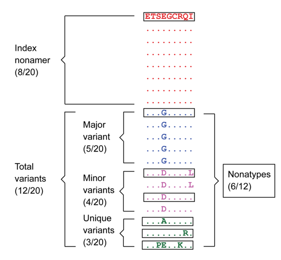

**Figure 1** 
The “Index” nonamer is the most prevalent sequence. The “Major” variant is the most common variant of the index. “Minor” variants are multiple different repeated sequences, each with incidences less than that or occasionally equal of the major variant. “Unique” variants are those represented by a single aligned sequence. “Nonatypes” (boxed) are the distinct variant sequences at a given nonamer position; in this example one of major, two of a minor, and three of unique [(Hu et al., 2013)](https://journals.plos.org/plosone/article?id=10.1371/journal.pone.0059994). 

(section-two)=
# Browser compatibility

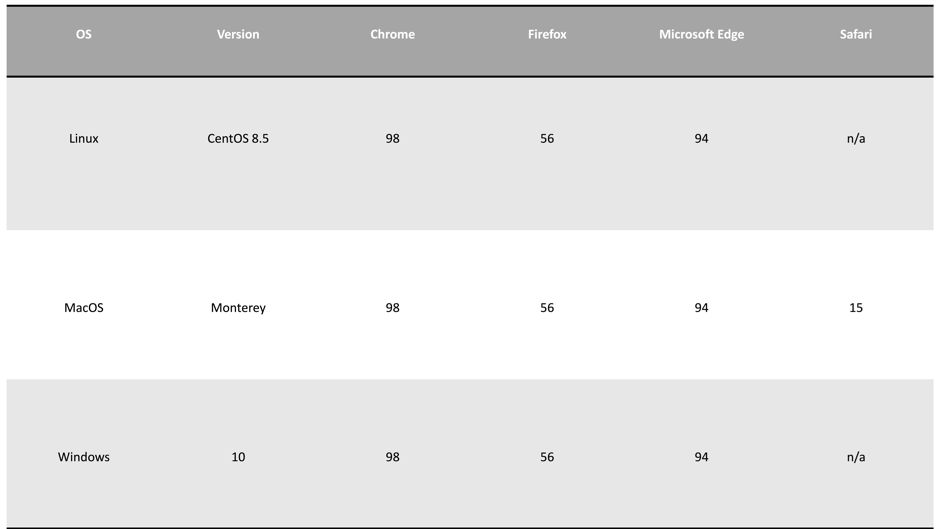

## Accessibility
The user can access the web page [here](sevant.bezmialem.edu.tr). 

(section-three)=
# Workflow

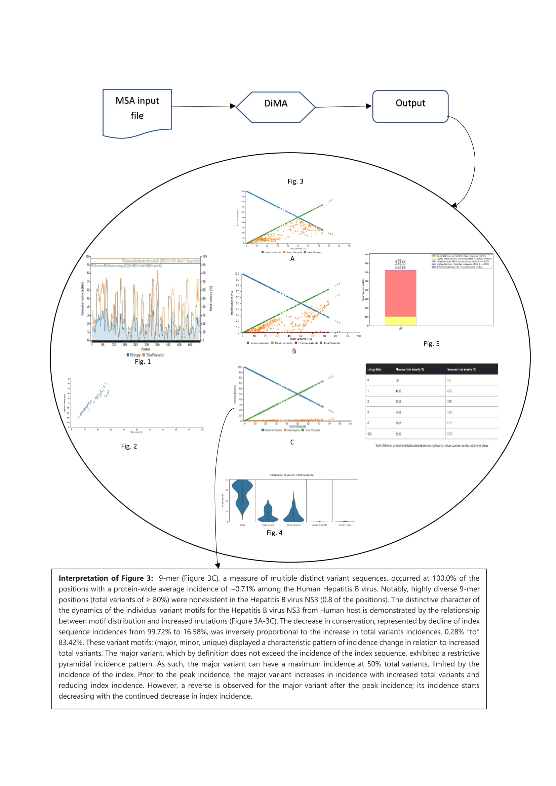

**Figure 2**
sevant takes the MSA file as an input, calculates entropy, and characterizes the diversity motifs. sevant outputs multiple visual plots/table and presents a report-style, human-readable, and printable description of the plots and their interpretations.

(section-four)=
# Input file and parameters

- **Input file**

The input file is a multiple sequence alignment file of the protein to be analyzed. The user has to provide the alignment file as input. It can be either in “.aln”, “.fas” or “.taln” format.
 
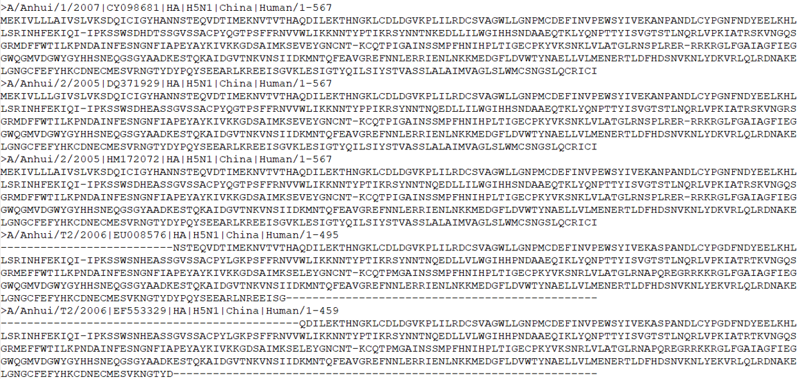
 
- **Parameters**

  - **Taxonomy ID**
  
The user has to enter the taxonomy ID of the organism being analyzed.  

If necessary, the user can go to the [NCBI Taxonomy Database](https://www.ncbi.nlm.nih.gov/taxonomy) to search for the Taxonomy ID.  

The “help” text is directly hyperlinked to the NCBI Taxonomy Database for convenience.

  - **Low Support Threshold**

The minimum required support for each k-mer position. The support at a given alignment position is the number of sequences that exhibited a standard amino acid (excluding gaps (-), and unknown (x) or ambiguous amino acid (B, Z, or J). The default value is 30. The user can use different value based on his/her requirement.

```{note}
The default value is **30**.
```

  - **Viral Protein Name**
  
The user has to fill in the name of the protein being analysed because it will appear in the interpretation report presented by sevant.

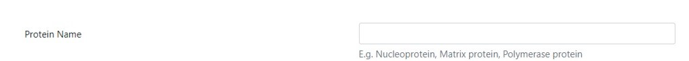

  - **Isolation Host Label**

The next field is isolation host. This is the source organisms from where the sequences being analysed have been isolated from, such as human or avian.
  

 
  - **K-mer Length (sliding size of window)**
  
The next field is the K-mer length. It is by default set to **9**. The user can set his/her own desired length


  - **Select the Aligned Sequence File**
  
In this field the user is presented with a choice to either enter a pre-aligned file in the stated formats and has to click on the file type uploaded or s/he can upload a [DiMA](https://dima.bezmialem.edu.tr/) file in the JSON format. The difference between the two choices is that if the user has not calculated the Shannon’s entropy of the protein to determine the conserved motifs, then an aligned file is desired. In case the user has the entropy calculated file and only desires the graphic output and explanation, s/he can upload the JSON file.


A sample MSA input file is provided that can be downloaded and uploaded by clicking on the “Choose File” option.

The user should select the appropriate radio button for the format of the MSA or choose the [DiMA](https://dima.bezmialem.edu.tr/) JSON file. In case of no selection, the results cannot be interpreted and presented correctly.
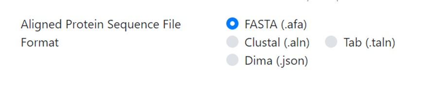

  - **Obtaining result notifications by email**
The last field is the email for intimation once the results are completed.


```{warning}
All parameters are required fields except the user email.
```
After all the information is entered, the user has to click "submit". 

A message, highlighted in green background, appears at the top of the page with the analysis ID, which should be noted for future reference.

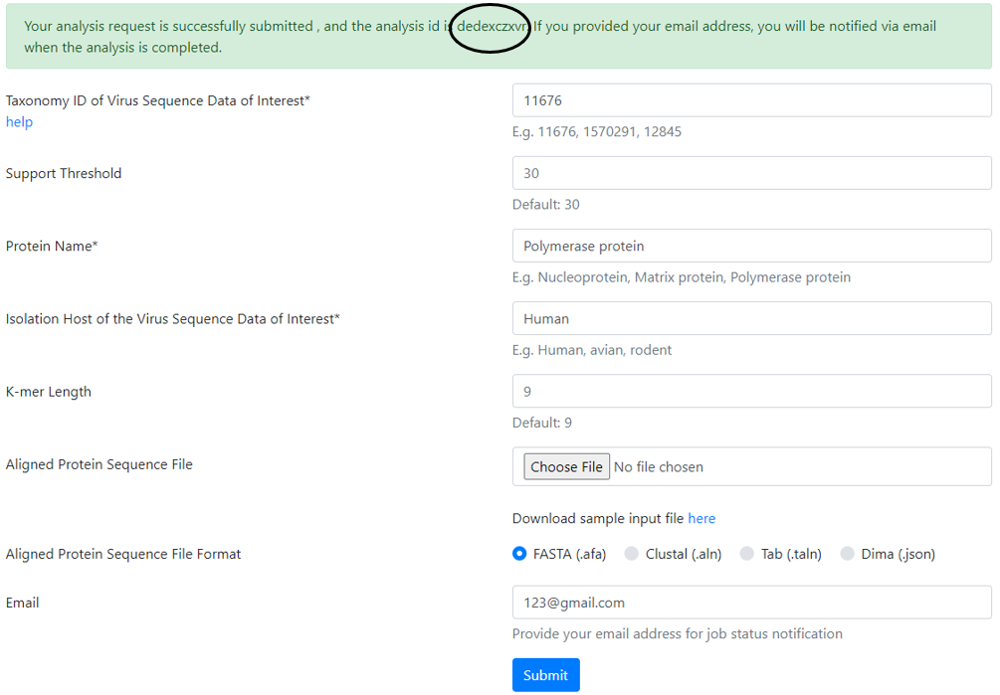

The user can use this ID to retrieve the results once email is received. The results can also be retrieved without the email by clicking the link “View Protein Analysis Result” on the top left corner of the page. 


Once clicked on the link, a pop-up window will appear.

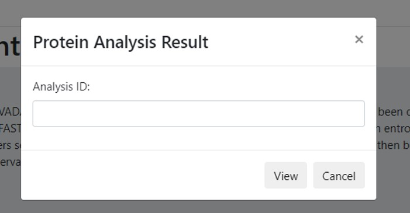

The analysis ID is to be entered in the field and click “View”. The result page should appear with the graphs and table with their accompanying explanations. 

(section-five)=
# How to interpret the results

```{note}
The output is based on your input sequences. The results vary according to input multiple protein sequences analyzed and on the protein type being analyzed.
```

- **Result presentation**


```{note}
sevant provides five (5) graphs and one (1) table.
```


- **Sample Graph 1**

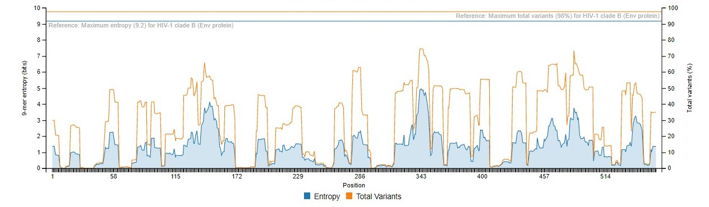

This graph presents the overall diversity of the aligned nonamer sequences for which entropy calculation and classification of motifs is done of the submitted sequences of the user protein. The nonamer entropy (in bits) on the y-axis (left) is presented as the grey shaded area under the curve. The total variants (in %) is the orange line superimposed with the nonamer entropy is given on the y-axis on the right side of the graph.  The x-axis is the total nonamer positions analyzed.

The reference lines (orange and grey) at the top of the graph represent the maximum entropy calculated for HIV-1 Clade B envelope protein (Hu et al., 2013) which is the benchmark for entropy calculations and motif variants obtained. 


- **Sample Graph 2**

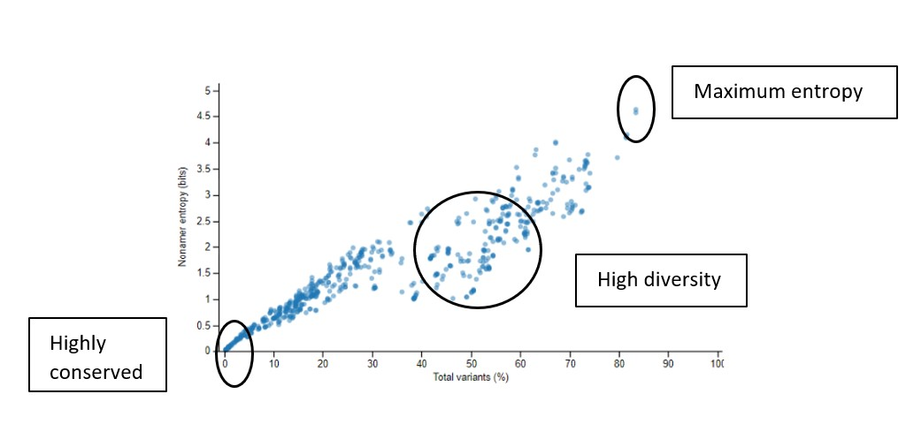

This graph shows the scatter plot indicating how the nonamer entropy is related to the total variants obtained for the positions analyzed. If the nonamer is conserved it appears towards the base of the graph (near the beginning of the graph). In the case of high diversity, the entropy result appears more scattered as the total number of variants increases.

- **Sample Graph 3**

```{image} images/graph3.jpg
:alt: graph3
:class: bg-primary
:width: 400px
:align: center
```
This graph demonstrates the relationship between motif distribution and increasing mutations. The decrease in conservation is represented by decline of index sequence incidences. This graph is divided into 3 sub graphs each representing the incidences of the classified motifs. Based on the k-mer position analyses, there can be an i) index motif, the most common motif across all nonamer positions, ii) major variant, which is the most common variant after the conserved index nonamer motif, iii) minor variant, that which occurs as the most frequent after the major variant and iv) unique variant, the least commonly occurring variant nonamer. 

- **Sample Graph 4**

A simple violin plot of the frequency of distribution of the classified motifs. The width of the plot (x-axis) represents the frequency distribution of a given incidence of the indicated motif. The wider the plot, the higher the frequency. The yellow dot represents the median incidence value.

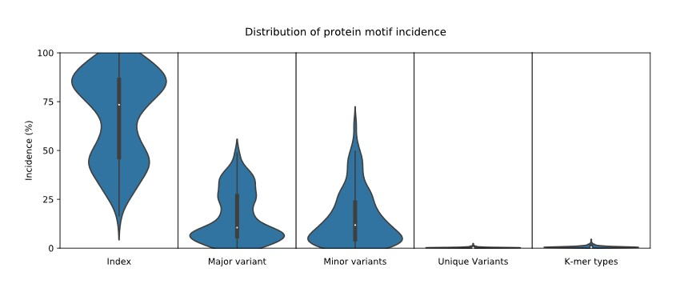

- **Sample Graph 5**

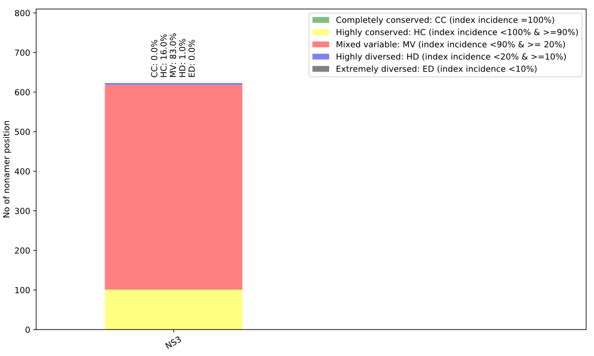

This bar plot illustrates the distribution of conservation levels for the nonamer positions of the protein analyzed. 

- **Sample Table 1**

This table provides the minimum and maximum value of total variants at each entropy boundary values observed. 

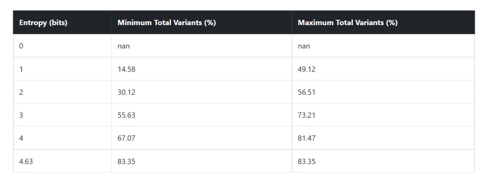

(section-six)=
# FAQs

1. **Is there any copyright on the graphs?**\ 
No. But it is important to cite the website and our publications.

2. **How to cite?**\
With a reference to the website: [sevant.bezmialem.edu.tr](sevant.bezmialem.edu.tr)


(section-seven)=
# Support
In case of any further queries, please email *makhan@bezmialem.edu.tr*

## Team

- Muhammad Farhan Sjaugi
- Kresnodityo Jatiputro Widianto
- Eyyub Selim Ünlü 
- Muhammed Miran Öncel 
- Shanweera Tharanga
- Rashid Mukaila 
- Muhammet A. Celik 
- Tcharné Adnaane Bawa 
- Ayesha Fatima 
- Mohammad Asif Khan